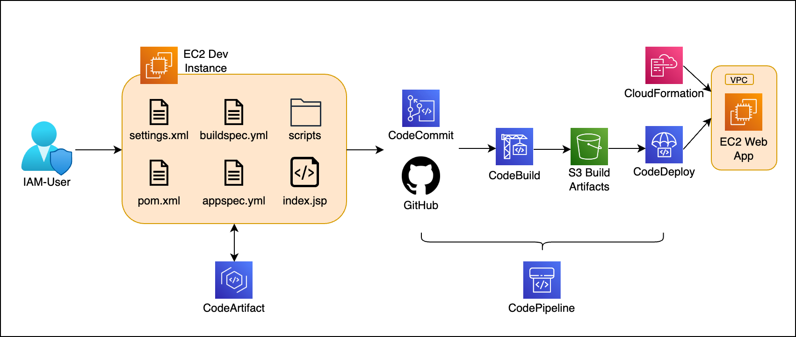

# Simple end-to-end CI/CD Pipeline on AWS

## 🌍 Overview
Simulating an end-to-end CI/CD Pipeline for a Java web app using AWS Deployment Tools, using CodeArtifact to cache dependencies, CodeBuild to run the build servers, CodeDeploy to deploy to production, CodePipeline to automate these, and CloudFormation to set-up the resource stack.

## 🏗️ Architecture

## 🧱 Setup Instructions
### Step 1: Set-up project using Maven in EC2

### Step 2: Set-up Code Repo

### Step 3: Set-up CodeArtifact

### Step 4: Set-up CodeBuild

### Step 5: Set-up CodeDeploy

### Step 5: Set-up CodePipeline

## 🛠️ Configuration Details

## 🍽️ Usage Instructions

## 🚨 Troubleshooting
### Common Issues
- **Issue 1:** Unable to compile and publish dependencies to CodeArtifact
    - **Solution:** If necessary, start from a fresh instance or uninstall Maven first. Switch your Java runtime and compiler to Java 8 (openjdk 1.8) with `sudo alternatives --config java` and `sudo alternatives --config javac` before installing Maven, and ensure that you get at least Maven version 3.2.5 or above. Recompile again with `mvn -s settings.xml compile`.